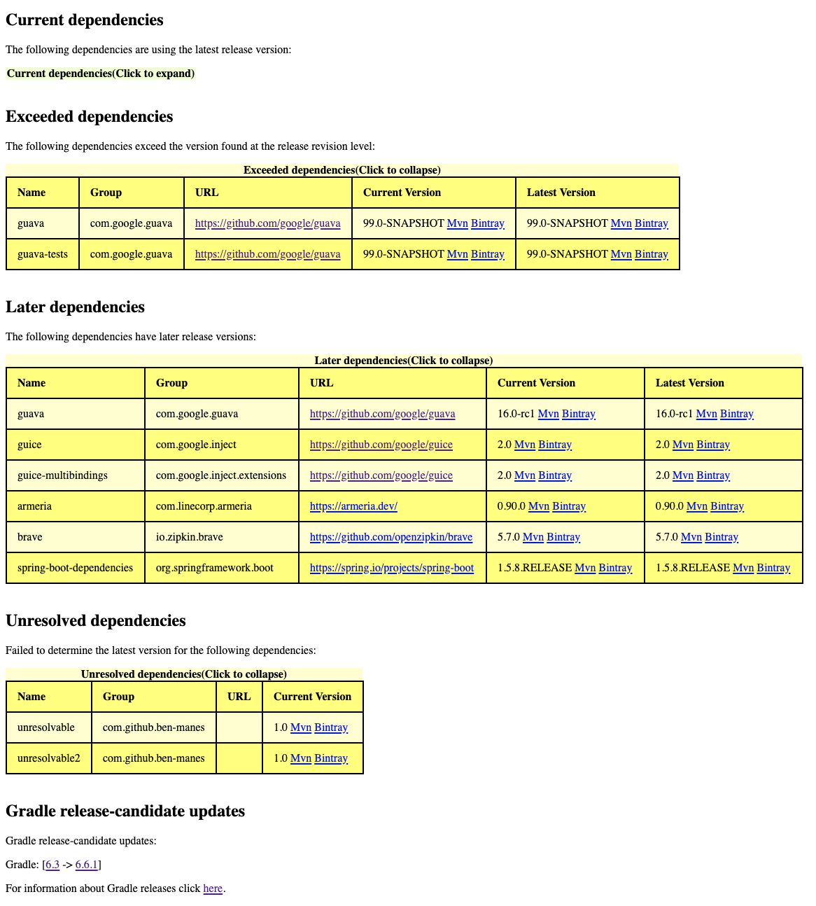

[](https://github.com/ben-manes/gradle-versions-plugin/actions)
[](https://plugins.gradle.org/plugin/com.github.ben-manes.versions)

# Gradle Versions Plugin

In the spirit of the [Maven Versions Plugin](https://www.mojohaus.org/versions-maven-plugin),
this plugin provides a task to determine which dependencies have updates. Additionally, the plugin
checks for updates to Gradle itself.

**Table of contents**
<!-- TOC -->
- [Usage](#usage)
  - [plugins block](#plugins-block)
  - [buildscript block](#buildscript-block)
  - [Using a Gradle init script](#using-a-gradle-init-script)
  - [Related plugins](#related-plugins)
  - [Known issues](#workarounds-for-related-gradle-issues)
- [dependencyUpdates](#dependencyupdates)
  - [Multi-project build](#multi-project-build)
  - [Revisions](#revisions)
  - [RejectVersionsIf and componentSelection](#rejectversionsif-and-componentselection)
  - [Gradle Release Channel](#gradle-release-channel)
  - [Constraints](#constraints)
  - [Kotlin DSL](#kotlin-dsl)
  - [Try out the samples](#try-out-the-samples)
  - [Report format](#report-format)
<!-- /TOC -->

## Usage

You can add this plugin to your top-level build script using the following configuration:

### `plugins` block:


```groovy
plugins {
  id "com.github.ben-manes.versions" version "$version"
}
```
or via the

### `buildscript` block:
```groovy
apply plugin: "com.github.ben-manes.versions"

buildscript {
  repositories {
    gradlePluginPortal()
  }

  dependencies {
    classpath "com.github.ben-manes:gradle-versions-plugin:$version"
  }
}
```

### Using a Gradle init script ###
You can also transparently add the plugin to every Gradle project that you run via a [Gradle init script](https://docs.gradle.org/current/userguide/init_scripts.html):

<details open>
<summary>Groovy</summary>

`$HOME/.gradle/init.d/add-versions-plugin.gradle`
```groovy
initscript {
  repositories {
     gradlePluginPortal()
  }

  dependencies {
    classpath 'com.github.ben-manes:gradle-versions-plugin:+'
  }
}

allprojects {
  apply plugin: com.github.benmanes.gradle.versions.VersionsPlugin

  tasks.named("dependencyUpdates").configure {
    // configure the task, for example wrt. resolution strategies
  }
}
```

</details>

<details open>
<summary>Kotlin</summary>

`$HOME/.gradle/init.d/add-versions-plugin.init.gradle.kts`
```kotlin
import com.github.benmanes.gradle.versions.updates.DependencyUpdatesTask

initscript {
  repositories {
    gradlePluginPortal()
  }
  dependencies {
    classpath("com.github.ben-manes:gradle-versions-plugin:+")
  }
}

allprojects {
  apply<com.github.benmanes.gradle.versions.VersionsPlugin>()

  tasks.named<DependencyUpdatesTask>("dependencyUpdates").configure {
    // configure the task, for example wrt. resolution strategies
  }
}
```

</details>

### Related Plugins ###
You may also wish to explore additional functionality provided by,
 - [version-catalog-update-plugin](https://github.com/littlerobots/version-catalog-update-plugin)
 - [gradle-versions-filter-plugin](https://github.com/janderssonse/gradle-versions-filter-plugin)
 - [gradle-upgrade-interactive](https://github.com/kevcodez/gradle-upgrade-interactive)
 - [gradle-use-latest-versions](https://github.com/patrikerdes/gradle-use-latest-versions-plugin)
 - [gradle-update-checker](https://github.com/marketplace/actions/gradle-update-checker)
 - [gradle-libraries-plugin](https://github.com/fkorotkov/gradle-libraries-plugin)
 - [gradle-update-notifier](https://github.com/y-yagi/gradle-update-notifier)
 - [refreshVersions](https://github.com/jmfayard/refreshVersions)
 - [update-versions-gradle-plugin](https://github.com/tomasbjerre/update-versions-gradle-plugin)
 - [caupain](https://github.com/deezer/caupain/)

### Workarounds for related Gradle Issues ###
 - https://github.com/gradle/gradle/issues/24636: setting the flag `org.gradle.configuration-cache.problems=warn` in `gradle.properties` causes the dependency check to fail to find dependencies with message `No dependencies found`.  Comment out that line until the upstream issue with Gradle is fixed.
 - In Gradle 9+, parallel execution is incompatible with having one project's task resolving another project configuration's dependencies. This requires obtaining an internal lock not available to plugin developers, but is relied on by native plugins (e.g. for IDE support). This simply requires passing the `--no-parallel` flag when running the `dependencyUpdates` task, which allows you to continue to benefit from the speedup in other build scenarios.

## Tasks

### `dependencyUpdates`

Displays a report of the project dependencies that are up-to-date, exceed the latest version found,
have upgrades, or failed to be resolved. When a dependency cannot be resolved the exception is
logged at the `info` level.

To refresh the cache (i.e. fetch the new releases/versions of the dependencies), use flag `--refresh-dependencies`.

Gradle updates are checked for on the `current`, `release-candidate` and `nightly` release channels. The plaintext
report displays gradle updates as a separate category in breadcrumb style (excluding nightly builds). The xml and json
reports include information about all three release channels, whether a release is considered an update with respect to
the running (executing) gradle instance, whether an update check on a release channel has failed, as well as a reason
field explaining failures or missing information. The update check may be disabled using the `checkForGradleUpdate` flag.

#### Multi-project build

In a multi-project build, running this task in the root project will generate a consolidated/merged
report for dependency updates in all subprojects. Alternatively, you can run the task separately in
each subproject to generate separate reports for each subproject.

#### Revisions

The `revision` task property controls the [Ivy resolution strategy][ivy_resolution_strategy] for determining what constitutes
the latest version of a dependency. Maven's dependency metadata does not distinguish between milestone and release versions.
The following strategies are natively supported by Gradle:

  * release: selects the latest release
  * milestone: select the latest version being either a milestone or a release (default)
  * integration: selects the latest revision of the dependency module (such as SNAPSHOT)

The strategy can be specified either on the task or as a system property for ad hoc usage:

```groovy
gradle dependencyUpdates -Drevision=release --no-parallel
```

#### RejectVersionsIf and componentSelection

To further define which version to accept, you need to define what means an unstable version. Sadly, there are
no agreed standard on this, but this is a good starting point:

<details open>
<summary>Groovy</summary>

```groovy
def isNonStable = { String version ->
  def stableKeyword = ['RELEASE', 'FINAL', 'GA'].any { it -> version.toUpperCase().contains(it) }
  def regex = /^[0-9,.v-]+(-r)?$/
  return !stableKeyword && !(version ==~ regex)
}
```

</details>

<details open>
<summary>Kotlin</summary>

```kotlin
fun isNonStable(version: String): Boolean {
    val stableKeyword = listOf("RELEASE", "FINAL", "GA").any { version.uppercase().contains(it) }
    val regex = "^[0-9,.v-]+(-r)?$".toRegex()
    val isStable = stableKeyword || regex.matches(version)
    return isStable.not()
}
```

</details>

You can then configure [Component Selection Rules][component_selection_rules].
The current version of a component can be retrieved with the `currentVersion` property.
You can either use the simplified syntax `rejectVersionIf { ... }` or configure a complete resolution strategy.


<details open>
<summary>Groovy</summary>

<!--  Always modify first examples/groovy and make sure that it works. THEN modify the README -->

Example 1: reject all non stable versions

```groovy
// https://github.com/ben-manes/gradle-versions-plugin
tasks.named("dependencyUpdates").configure {
  rejectVersionIf {
    isNonStable(it.candidate.version)
  }
}
```

Example 2: disallow release candidates as upgradable versions from stable versions

```groovy
// https://github.com/ben-manes/gradle-versions-plugin
tasks.named("dependencyUpdates").configure {
  rejectVersionIf {
    isNonStable(it.candidate.version) && !isNonStable(it.currentVersion)
  }
}
```

Example 3: using the full syntax

```groovy
// https://github.com/ben-manes/gradle-versions-plugin
tasks.named("dependencyUpdates").configure {
  resolutionStrategy {
    componentSelection {
      all {
        if (isNonStable(it.candidate.version) && !isNonStable(it.currentVersion)) {
          reject('Release candidate')
        }
      }
    }
  }
}
```

</details>
<details open>
<summary>Kotlin</summary>

<!--  Always modify first examples/kotlin and make sure that it works. THEN modify the README -->

Example 1: reject all non stable versions

```kotlin
import com.github.benmanes.gradle.versions.updates.DependencyUpdatesTask

// https://github.com/ben-manes/gradle-versions-plugin
tasks.withType<DependencyUpdatesTask> {
  rejectVersionIf {
    isNonStable(candidate.version)
  }
}
```

Example 2: disallow release candidates as upgradable versions from stable versions

```kotlin
import com.github.benmanes.gradle.versions.updates.DependencyUpdatesTask

// https://github.com/ben-manes/gradle-versions-plugin
tasks.withType<DependencyUpdatesTask> {
  rejectVersionIf {
    isNonStable(candidate.version) && !isNonStable(currentVersion)
  }
}
```

Example 3: using the full syntax

```kotlin
import com.github.benmanes.gradle.versions.updates.DependencyUpdatesTask

// https://github.com/ben-manes/gradle-versions-plugin
tasks.withType<DependencyUpdatesTask> {
  resolutionStrategy {
    componentSelection {
      all(Action<ComponentSelectionWithCurrent> {
        if (isNonStable(candidate.version) && !isNonStable(currentVersion)) {
          reject("Release candidate")
        }
      })
    }
  }
}
```
</details>

#### Gradle Release Channel

The `gradleReleaseChannel` task property controls which release channel of the Gradle project is used to check for available Gradle updates. Options are:

  * `current`
  * `release-candidate`
  * `nightly`

The default is `release-candidate`. The value can be changed as shown below:

```groovy
dependencyUpdates.gradleReleaseChannel="current"
```

#### Gradle Versions Api Base URL

The `gradleVersionsApiBaseUrl` task property provides an option for customization of the Gradle versions service URL.
If not specified, the default value https://services.gradle.org/versions/ is used.
The customization can be useful in restricted environments without direct internet access and proxy availability.

#### Constraints

If you use constraints, for example to define a BOM using the [`java-platform`](https://docs.gradle.org/current/userguide/java_platform_plugin.html)
plugin or to [manage](https://docs.gradle.org/current/userguide/dependency_constraints.html)
transitive dependency versions, you can enable checking of constraints by specifying the `checkConstraints`
attribute of the `dependencyUpdates` task.
If you want to check external constraints (defined in init scripts or by Gradle since 7.3.2) you can do so by specifying the `checkBuildEnvironmentConstraints`
attribute of the `dependencyUpdates` task.

```groovy
tasks.named("dependencyUpdates").configure {
    checkConstraints = true
    checkBuildEnvironmentConstraints = true
}
```

#### Kotlin DSL

If using Gradle's [kotlin-dsl][kotlin_dsl], you could configure the `dependencyUpdates` like this:

```kotlin
import com.github.benmanes.gradle.versions.updates.DependencyUpdatesTask

tasks.named<DependencyUpdatesTask>("dependencyUpdates").configure {

  // optional parameters
  checkForGradleUpdate = true
  outputFormatter = "json"
  outputDir = "build/dependencyUpdates"
  reportfileName = "report"
}
```

Note: Do use the `plugins { .. }` syntax if you use the Kotlin DSL.

#### Configuration filter
You can change which dependency configurations the plugin checks for updates like this:

```groovy
// https://github.com/ben-manes/gradle-versions-plugin
tasks.named("dependencyUpdates").configure {
  filterConfigurations {
    it.name.equals("runtimeClasspath") || it.name.equals("compileClasspath")
  }
}
```


#### Try out the samples

Have a look at [`examples/groovy`](https://github.com/ben-manes/gradle-versions-plugin/tree/master/examples/groovy) and [`examples/kotlin`](https://github.com/ben-manes/gradle-versions-plugin/tree/master/examples/kotlin)

```bash
# Publish the latest version of the plugin to mavenLocal()
$ ./gradlew publishToMavenLocal

# Try out the samples
$ ./gradlew -p examples/groovy dependencyUpdate
$ ./gradlew -p examples/kotlin dependencyUpdate
```

### Report format

The task property `outputFormatter` controls the report output format. The following values are supported:

  * `"plain"`: format output file as plain text (default)
  * `"json"`: format output file as json text
  * `"xml"`: format output file as xml text, can be used by other plugins (e.g. sonar)
  * `"html"`: format output file as html
  * `Closure`: will be called with the result of the dependency update analysis

You can also set multiple output formats using comma as the separator:

```groovy
gradle dependencyUpdates -Drevision=release -DoutputFormatter=json,xml,html --no-parallel
```

The task property `outputDir` controls the output directory for the report  file(s). The directory will be created if it does not exist.
The default value is set to `build/dependencyUpdates`

```groovy
gradle dependencyUpdates -Drevision=release -DoutputFormatter=json -DoutputDir=/any/path/with/permission --no-parallel
```

Last the property `reportfileName` sets the filename (without extension) of the generated report. It defaults to `report`.
The extension will be set according to the used output format.

```groovy
gradle dependencyUpdates -Drevision=release -DoutputFormatter=json -DreportfileName=myCustomReport --no-parallel
```

This displays a report to the console.


<details open>
<summary>Text Report</summary>

```
------------------------------------------------------------
: Project Dependency Updates (report to plain text file)
------------------------------------------------------------

The following dependencies are using the latest integration version:
 - backport-util-concurrent:backport-util-concurrent:3.1
 - backport-util-concurrent:backport-util-concurrent-java12:3.1

The following dependencies exceed the version found at the integration revision level:
 - com.google.guava:guava [99.0-SNAPSHOT <- 16.0-rc1]
     https://code.google.com/p/guava-libraries
 - com.google.guava:guava-tests [99.0-SNAPSHOT <- 16.0-rc1]
     https://code.google.com/p/guava-libraries

The following dependencies have later integration versions:
 - com.google.inject:guice [2.0 -> 3.0]
     https://code.google.com/p/google-guice/
 - com.google.inject.extensions:guice-multibindings [2.0 -> 3.0]
     https://code.google.com/p/google-guice/

Gradle updates:
 - Gradle: [4.6 -> 4.7 -> 4.8-rc-2]
```
</details>

Alternatively, the report may be outputed to a structured file.

<details>
<summary>Json report</summary>

```json
{
  "current": {
    "dependencies": [
      {
        "group": "backport-util-concurrent",
        "version": "3.1",
        "name": "backport-util-concurrent",
        "projectUrl": "https://backport-jsr166.sourceforge.net/"
      },
      {
        "group": "backport-util-concurrent",
        "version": "3.1",
        "name": "backport-util-concurrent-java12",
        "projectUrl": "https://backport-jsr166.sourceforge.net/"
      }
    ],
    "count": 2
  },
  "gradle": {
    "enabled": true,
    "current": {
      "version": "4.7",
      "reason": "",
      "isUpdateAvailable": true,
      "isFailure": false
    },
    "nightly": {
      "version": "4.9-20180526235939+0000",
      "reason": "",
      "isUpdateAvailable": true,
      "isFailure": false
    },
    "releaseCandidate": {
      "version": "4.8-rc-2",
      "reason": "",
      "isUpdateAvailable": true,
      "isFailure": false
    },
    "running": {
      "version": "4.6",
      "reason": "",
      "isUpdateAvailable": false,
      "isFailure": false
    }
  },
  "exceeded": {
    "dependencies": [
      {
        "group": "com.google.guava",
        "latest": "16.0-rc1",
        "version": "99.0-SNAPSHOT",
        "name": "guava",
        "projectUrl": "https://code.google.com/p/guava-libraries"
      },
      {
        "group": "com.google.guava",
        "latest": "16.0-rc1",
        "version": "99.0-SNAPSHOT",
        "name": "guava-tests",
        "projectUrl": "https://code.google.com/p/guava-libraries"
      }
    ],
    "count": 2
  },
  "outdated": {
    "dependencies": [
      {
        "group": "com.google.inject",
        "available": {
          "release": "3.0",
          "milestone": null,
          "integration": null
        },
        "version": "2.0",
        "name": "guice",
        "projectUrl": "https://code.google.com/p/google-guice/"
      },
      {
        "group": "com.google.inject.extensions",
        "available": {
          "release": "3.0",
          "milestone": null,
          "integration": null
        },
        "version": "2.0",
        "name": "guice-multibindings",
        "projectUrl": "https://code.google.com/p/google-guice/"
      }
    ],
    "count": 2
  },
  "unresolved": {
    "dependencies": [
      {
        "group": "com.github.ben-manes",
        "version": "1.0",
        "reason": "Could not find any version that matches com.github.ben-manes:unresolvable:latest.milestone.",
        "name": "unresolvable"
      },
      {
        "group": "com.github.ben-manes",
        "version": "1.0",
        "reason": "Could not find any version that matches com.github.ben-manes:unresolvable2:latest.milestone.",
        "name": "unresolvable2"
      }
    ],
    "count": 2
  },
  "count": 8
}
```
</details>

<details>
<summary>XML report</summary>


```xml
<response>
  <count>8</count>
  <current>
    <count>2</count>
    <dependencies>
      <dependency>
        <name>backport-util-concurrent</name>
        <group>backport-util-concurrent</group>
        <version>3.1</version>
        <projectUrl>https://backport-jsr166.sourceforge.net/</projectUrl>
      </dependency>
      <dependency>
        <name>backport-util-concurrent-java12</name>
        <group>backport-util-concurrent</group>
        <version>3.1</version>
        <projectUrl>https://backport-jsr166.sourceforge.net/</projectUrl>
      </dependency>
    </dependencies>
  </current>
  <outdated>
    <count>2</count>
    <dependencies>
      <outdatedDependency>
        <name>guice</name>
        <group>com.google.inject</group>
        <version>2.0</version>
        <available>
          <release>3.0</release>
        </available>
        <projectUrl>https://code.google.com/p/google-guice/</projectUrl>
      </outdatedDependency>
      <outdatedDependency>
        <name>guice-multibindings</name>
        <group>com.google.inject.extensions</group>
        <version>2.0</version>
        <available>
          <release>3.0</release>
        </available>
        <projectUrl>https://code.google.com/p/guava-libraries</projectUrl>
      </outdatedDependency>
    </dependencies>
  </outdated>
  <exceeded>
    <count>2</count>
    <dependencies>
      <exceededDependency>
        <name>guava</name>
        <group>com.google.guava</group>
        <version>99.0-SNAPSHOT</version>
        <latest>16.0-rc1</latest>
        <projectUrl>https://code.google.com/p/guava-libraries</projectUrl>
      </exceededDependency>
      <exceededDependency>
        <name>guava-tests</name>
        <group>com.google.guava</group>
        <version>99.0-SNAPSHOT</version>
        <latest>16.0-rc1</latest>
        <projectUrl>https://code.google.com/p/guava-libraries</projectUrl>
      </exceededDependency>
    </dependencies>
  </exceeded>
  <unresolved>
    <count>2</count>
    <dependencies>
      <unresolvedDependency>
        <name>unresolvable</name>
        <group>com.github.ben-manes</group>
        <version>1.0</version>
        <reason>Could not find any version that matches com.github.ben-manes:unresolvable:latest.release.</reason>
      </unresolvedDependency>
      <unresolvedDependency>
        <name>unresolvable2</name>
        <group>com.github.ben-manes</group>
        <version>1.0</version>
        <reason>Could not find any version that matches com.github.ben-manes:unresolvable2:latest.release.</reason>
      </unresolvedDependency>
    </dependencies>
  </unresolved>
  <gradle>
    <enabled>true</enabled>
    <running>
      <version>4.6</version>
      <isUpdateAvailable>false</isUpdateAvailable>
      <isFailure>false</isFailure>
      <reason></reason>
    </running>
    <current>
      <version>4.7</version>
      <isUpdateAvailable>true</isUpdateAvailable>
      <isFailure>false</isFailure>
      <reason></reason>
    </current>
    <releaseCandidate>
      <version>4.8-rc-2</version>
      <isUpdateAvailable>true</isUpdateAvailable>
      <isFailure>false</isFailure>
      <reason></reason>
    </releaseCandidate>
    <nightly>
      <version>4.9-20180526235939+0000</version>
      <isUpdateAvailable>true</isUpdateAvailable>
      <isFailure>false</isFailure>
      <reason></reason>
    </nightly>
  </gradle>
</response>
```
</details>

<details>
<summary>HTML report</summary>

[](examples/html-report.png)
</details>

<details>
<summary>Custom report</summary>

If you need to create a report in a custom format, you can set the `dependencyUpdates` tasks's `outputFormatter` property to a Closure. The closure will be called with a single argument that is an instance of [com.github.benmanes.gradle.versions.reporter.result.Result](gradle-versions-plugin/src/main/kotlin/com/github/benmanes/gradle/versions/reporter/result/Result.kt).

For example, if you wanted to create an html table for the upgradable dependencies, you could use:

```groovy
tasks.named("dependencyUpdates").configure {
  outputFormatter = { result ->
    def updatable = result.outdated.dependencies
    if (!updatable.isEmpty()){
      def writer = new StringWriter()
      def html = new groovy.xml.MarkupBuilder(writer)

      html.html {
        body {
          table {
            thead {
              tr {
                td("Group")
                td("Module")
                td("Current version")
                td("Latest version")
              }
            }
            tbody {
              updatable.each { dependency->
                tr {
                  td(dependency.group)
                  td(dependency.name)
                  td(dependency.version)
                  td(dependency.available.release ?: dependency.available.milestone)
                }
              }
            }
          }
        }
      }
      println writer.toString()
    }
  }
}
```
</details>

[kotlin_dsl]: https://github.com/gradle/kotlin-dsl
[ivy_resolution_strategy]: https://ant.apache.org/ivy/history/2.4.0/settings/version-matchers.html#Latest%20(Status)%20Matcher
[component_selection_rules]: https://docs.gradle.org/current/userguide/dynamic_versions.html#sec:component_selection_rules
