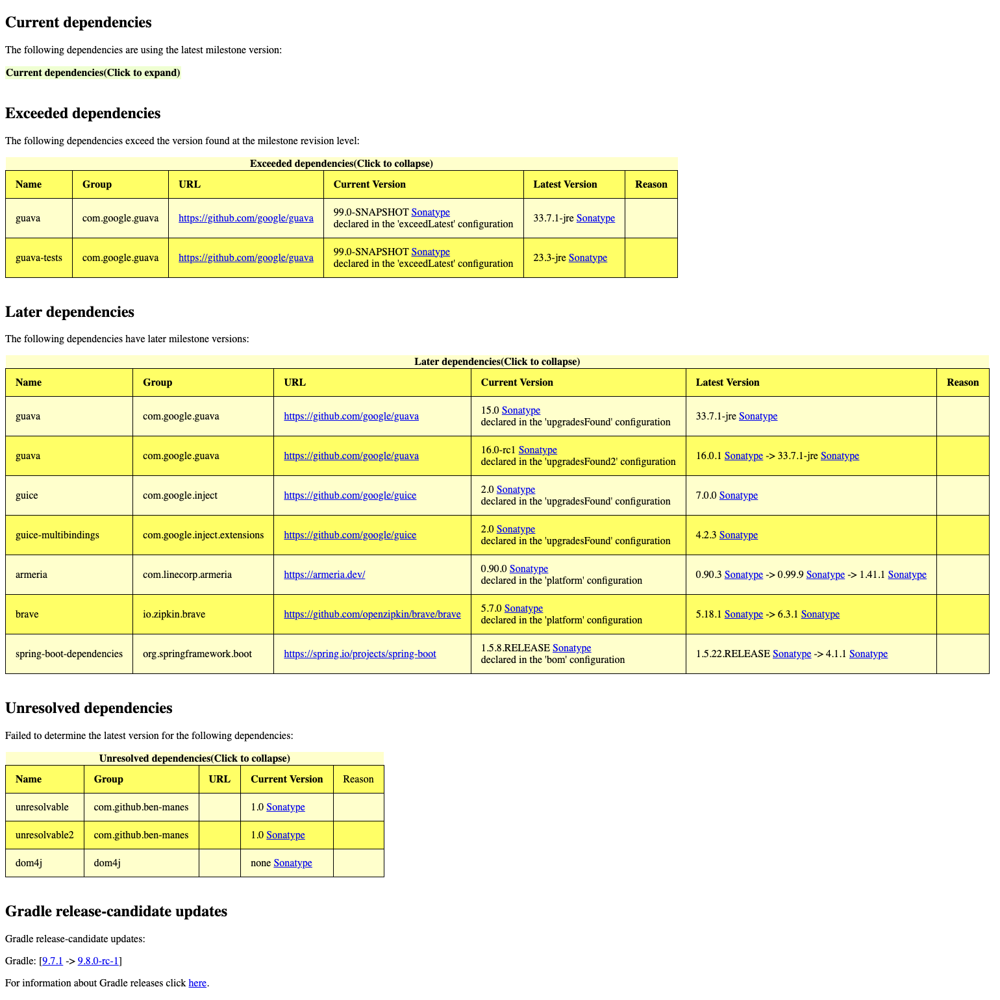

[](https://github.com/ben-manes/gradle-versions-plugin/actions/workflows/build.yml)
[](https://plugins.gradle.org/plugin/io.github.ben-manes.versions)

# Gradle Versions Plugin

This plugin reports which of your build's dependencies, plugins, and Gradle
itself have newer versions available, in the spirit of the [Maven Versions
Plugin](https://www.mojohaus.org/versions-maven-plugin).

**Table of contents**
<!-- TOC -->
- [Getting Started](#getting-started)
  - [Applying the plugin](#applying-the-plugin)
  - [Running the task](#running-the-task)
  - [Configuring the task](#configuring-the-task)
- [The `dependencyUpdates` task](#the-dependencyupdates-task)
  - [Cache invalidation](#cache-invalidation)
  - [Task properties](#task-properties)
    - [A recommended configuration](#a-recommended-configuration)
    - [What the report checks](#what-the-report-checks)
      - [Configuration filter](#configuration-filter)
        - [`filterConfigurations`](#filterconfigurations)
        - [`filterDeclaredConfigurations`](#filterdeclaredconfigurations)
        - [Choosing between them](#choosing-between-them)
        - [Kotlin Gradle Plugin](#kotlin-gradle-plugin)
        - [Android Gradle Plugin](#android-gradle-plugin)
      - [Constraints](#constraints)
    - [Which versions it offers](#which-versions-it-offers)
      - [Revisions](#revisions)
      - [Filtering unstable versions](#filtering-unstable-versions)
      - [Respecting declared bounds](#respecting-declared-bounds)
      - [Gradle release channel](#gradle-release-channel)
      - [Gradle versions API base URL](#gradle-versions-api-base-url)
    - [Report output](#report-output)
      - [Optional parameters](#optional-parameters)
      - [Report format](#report-format)
  - [Multi-project builds](#multi-project-builds)
    - [Shared task settings](#shared-task-settings)
    - [Composite builds](#composite-builds)
    - [Per-project reports](#per-project-reports)
  - [Isolated projects](#isolated-projects)
- [Other ways to apply the plugin](#other-ways-to-apply-the-plugin)
  - [The `plugins` block](#the-plugins-block)
  - [Legacy plugin application](#legacy-plugin-application)
  - [Contributor plugin](#contributor-plugin)
  - [Initialization script](#initialization-script)
- [Samples](#samples)
- [Compatibility](#compatibility)
- [Migrating from prior versions](#migrating-from-prior-versions)
  - [v0.59.0](#v0590)
  - [v0.58.0](#v0580)
  - [v0.57.0](#v0570)
  - [v0.56.0](#v0560)
  - [v0.55.0](#v0550)
  - [v0.54.0 and earlier](#v0540-and-earlier)
- [Related plugins](#related-plugins)
<!-- /TOC -->

## Getting Started

### Applying the plugin

The recommended way to add the Gradle Versions Plugin to any build is to apply
the settings plugin once in the settings script. This approach allows the plugin
to report updates for the plugins and buildscript dependencies that the settings
script declares, in addition to each project's own plugins, buildscript
dependencies, and dependencies. It also automatically covers every
subproject in a multi-project build (see [Multi-project
builds](#multi-project-builds)).

<details open>
<summary>Kotlin</summary>

"settings.gradle.kts":
```kotlin
plugins {
  id("io.github.ben-manes.versions.settings") version "$version"
}
```

</details>

<details>
<summary>Groovy</summary>

"settings.gradle":
```groovy
plugins {
  id 'io.github.ben-manes.versions.settings' version '$version'
}
```

</details>

> [!IMPORTANT]
> Replace `$version` with the current release, shown in the badge at the top of
> this page.

### Running the task

After adding the settings plugin to your build, run the `dependencyUpdates` task
to get the report of up-to-date and outdated dependencies (see [The
dependencyUpdates task](#the-dependencyupdates-task)):

```text
./gradlew dependencyUpdates
```

The report prints to the console and is written to
`build/dependencyUpdates/report.txt`:

```text
------------------------------------------------------------
: Project Dependency Updates (report to plain text file)
------------------------------------------------------------

The following dependencies have later milestone versions:
 - com.google.inject:guice [2.0 -> 7.0.0]
     https://github.com/google/guice
 - org.springframework.boot:spring-boot-dependencies [1.5.8.RELEASE -> 4.1.0]
     https://spring.io/projects/spring-boot

Gradle release-candidate updates:
 - Gradle: [8.4 -> 9.7.0]
```

### Configuring the task

The task is configured in the root project's build script:

<details open>
<summary>Kotlin</summary>

"build.gradle.kts":
```kotlin
import com.github.benmanes.gradle.versions.updates.DependencyUpdatesTask

tasks.named<DependencyUpdatesTask>("dependencyUpdates") {
  revision = "release"
  outputFormatter = "json"
}
```

</details>

<details>
<summary>Groovy</summary>

"build.gradle":
```groovy
tasks.named("dependencyUpdates").configure {
  revision = 'release'
  outputFormatter = 'json'
}
```

</details>

A build with no root build script can configure the task from the settings
script instead:

<details open>
<summary>Kotlin</summary>

"settings.gradle.kts":
```kotlin
import com.github.benmanes.gradle.versions.updates.DependencyUpdatesTask

gradle.rootProject {
  tasks.withType(DependencyUpdatesTask::class.java).configureEach {
    revision = "release"
    outputFormatter = "json"
  }
}
```

</details>

<details>
<summary>Groovy</summary>

"settings.gradle":
```groovy
import com.github.benmanes.gradle.versions.updates.DependencyUpdatesTask

gradle.rootProject {
  tasks.withType(DependencyUpdatesTask).configureEach {
    revision = 'release'
    outputFormatter = 'json'
  }
}
```

</details>

Every task property is covered in [Task properties](#task-properties), which
opens with [a recommended configuration](#a-recommended-configuration) most
builds want: a stability filter so that a pre-release version is not offered
as an update, and a bound so that an upgrade the build has ruled out is not
offered either.

## The `dependencyUpdates` task

Displays a report of the project dependencies that are up-to-date, exceed the
latest version found, have upgrades, or failed to be resolved. When a dependency
cannot be resolved the exception is logged at the `info` level.

The report includes dependencies declared through a version catalog, but the
plugin only reports—it never edits build files or the catalog. See [Related
plugins](#related-plugins) for tools that apply updates automatically.

The report also includes the dependencies that a plugin contributes lazily
rather than the build declaring them, such as the Kotlin standard library and
the tool versions of the `jacoco`, `checkstyle`, and `pmd` plugins. Their
current version is whatever the contributing plugin supplies when the task
runs, so a tool version the build never sets reports at the default bundled
with Gradle—a version that appears nowhere in the build script. The reports
mark such an entry so it does not read as a resolution bug, naming the
configuration the plugin declared it against:

```text
 - org.jacoco:org.jacoco.ant [0.8.11 -> 0.8.13]
     contributed by a plugin into the 'jacocoAnt' configuration
```

Set the extension's version, such as `jacoco.toolVersion`, to control what the
report compares against.

A plugin that fills its classpath when it is applied, rather than when the
configuration is first resolved, cannot be told apart from the build declaring
the dependency. Such an entry names the configuration it was declared against
instead:

```text
 - org.jetbrains.kotlin:kotlin-build-tools-impl [2.4.0 -> 2.4.10]
     declared in the 'kotlinAbiValidationCompatClasspath' configuration
```

A configuration the build declares against directly, such as a tool
configuration of its own, is named the same way. Reject the name an entry
shows with [`filterDeclaredConfigurations`](#filterdeclaredconfigurations) to
leave it out of the report.

Gradle updates are checked for on the `current`, `release-candidate` and
`nightly` release channels. The plain-text report displays Gradle updates as a
separate category in breadcrumb style, excluding nightly builds. The XML and
JSON reports cover all three release channels: whether a release is an update
with respect to the Gradle instance running the build, whether an update check
failed, and a reason field explaining failures or missing information. The
update check may be disabled using the `checkForGradleUpdate` flag.

### Cache invalidation

To find the latest version of a dependency, the task asks each repository which
versions exist. Gradle caches that answer for 24 hours, so a version published
within the last day may be missing from the report even though the repository
already has it. Re-run with `--refresh-dependencies` to bypass the cache and
query the repositories again:

```bash
./gradlew dependencyUpdates --refresh-dependencies
```

> [!TIP]
> The `--refresh-dependencies` flag applies to the whole build rather than to
> this task alone, so it also re-checks every other dependency the build
> resolves and is slower than a normal run. Use it when a release you are
> expecting does not appear, not routinely.

### Task properties

#### A recommended configuration

The properties below each solve a different problem, and most builds end up
wanting the same few. This is a complete starting point, assembled from the
sections that follow:

<details open>
<summary>Kotlin</summary>

```kotlin
import com.github.benmanes.gradle.versions.updates.DependencyUpdatesTask

fun String.isNonStable(): Boolean {
  val stableKeyword = listOf("RELEASE", "FINAL", "GA").any { uppercase().contains(it) }
  val regex = "^[0-9,.v-]+(-r|-jre|-android)?$".toRegex()
  val isStable = stableKeyword || regex.matches(this)
  return isStable.not()
}

tasks.named<DependencyUpdatesTask>("dependencyUpdates") {
  checkConstraints = true
  rejectVersionIf {
    (candidate.version.isNonStable() && !currentVersion.isNonStable()) ||
      !satisfiesDeclaredBound
  }
}
```

</details>

<details>
<summary>Groovy</summary>

```groovy
def isNonStable = { String version ->
  def stableKeyword = ['RELEASE', 'FINAL', 'GA'].any { it -> version.toUpperCase().contains(it) }
  def regex = /^[0-9,.v-]+(-r|-jre|-android)?$/
  return !stableKeyword && !(version ==~ regex)
}

tasks.named("dependencyUpdates").configure {
  checkConstraints = true
  rejectVersionIf {
    (isNonStable(candidate.version) && !isNonStable(currentVersion)) ||
      !satisfiesDeclaredBound
  }
}
```

</details>

- `checkConstraints` adds the versions a `constraints` block manages to the
  report (see [Constraints](#constraints)).
- The stability clause rejects a pre-release candidate unless the current
  version is itself a pre-release (see [Filtering unstable
  versions](#filtering-unstable-versions)).
- `!satisfiesDeclaredBound` rejects a candidate outside a `strictly` or
  `reject` bound the build declares, or outside the version a consumed
  platform states (see [Respecting declared
  bounds](#respecting-declared-bounds)).

Each piece stands alone: drop any line whose behavior the build does not
want, and the rest keep working.

The [configuration filters](#configuration-filter) are absent only because
their arguments are build-specific: the names to reject come off your own
report.

In Kotlin the `isNonStable` extension replaces a helper of that name the build
already has. A top-level `fun isNonStable(version: String)` compiles to the same
JVM signature, so keeping both fails the build with a platform declaration
clash.

#### What the report checks

##### Configuration filter

Two properties leave things out of the report. `filterConfigurations`
decides which configurations the task checks: a rejected configuration is
never resolved, and nothing reachable only through it is reported.
`filterDeclaredConfigurations` decides which entries the report keeps once
the checks have run: it matches the configuration name printed on the entry
itself.

###### `filterConfigurations`

The task checks every resolvable configuration of every project. A build
that only acts on its main classpaths can restrict the check to them:

<details open>
<summary>Kotlin</summary>

```kotlin
import com.github.benmanes.gradle.versions.updates.DependencyUpdatesTask

tasks.named<DependencyUpdatesTask>("dependencyUpdates") {
  filterConfigurations = Spec<Configuration> {
    it.name == "runtimeClasspath" || it.name == "compileClasspath"
  }
}
```

</details>

<details>
<summary>Groovy</summary>

```groovy
tasks.named("dependencyUpdates").configure {
  filterConfigurations {
    it.name == "runtimeClasspath" || it.name == "compileClasspath"
  }
}
```

</details>

A dependency leaves the report once every configuration that reaches it is
rejected, and everything reachable only through a rejected configuration
leaves with it—rejecting `compileClasspath` removes the build's own
dependencies too. Reach for this filter when a whole configuration is noise:
a skipped configuration also costs no version lookups, which suits the
classpaths a plugin fills for its own tooling, holding versions the build
never chose. The [Kotlin Gradle Plugin](#kotlin-gradle-plugin) and
[Android Gradle Plugin](#android-gradle-plugin) sections below give ready
sets.

###### `filterDeclaredConfigurations`

Start from the report line. Rejecting the name an entry shows removes the
entry:

```text
 - org.jacoco:org.jacoco.ant [0.8.11 -> 0.8.13]
     contributed by a plugin into the 'jacocoAnt' configuration
```

<details open>
<summary>Kotlin</summary>

```kotlin
import com.github.benmanes.gradle.versions.updates.DependencyUpdatesTask

tasks.named<DependencyUpdatesTask>("dependencyUpdates") {
  filterDeclaredConfigurations = Spec<String> { it != "jacocoAnt" }
}
```

</details>

<details>
<summary>Groovy</summary>

```groovy
tasks.named("dependencyUpdates").configure {
  filterDeclaredConfigurations { it != "jacocoAnt" }
}
```

</details>

It matches exactly the name the entry prints, from a "contributed by a
plugin into" line or a "declared in" one—a tool configuration the build
declares against directly is rejectable the same way. An entry leaves the
report when every name it shows is rejected, and an entry that names no
configuration is never affected: dependencies declared through
`implementation` and its siblings carry no name, so no rejection reaches
them, and where such a declaration also backs a named entry, rejection
removes the attribution line, never the dependency.

###### Choosing between them

Both filters silence a tooling configuration like the KGP and AGP sets
below; prefer `filterConfigurations` there, since it also skips the lookups.
They part ways when the name an entry shows is not one the task checks (see
[The `dependencyUpdates` task](#the-dependencyupdates-task)): a declarable
configuration read through a resolvable classpath that extends it, and
`implementation` holding a plugin's contribution, both show names
`filterConfigurations` is never offered. `filterDeclaredConfigurations`
matches the name shown, with no side effect on what is checked. Buildscript
and settings classpath entries ordinarily name no configuration, so neither
property affects them; one a plugin contributes is named `classpath` and can
be rejected like any other entry.

###### Kotlin Gradle Plugin

The Kotlin Gradle Plugin fills four fixed classpaths for its own tooling,
plus one `kotlinCompilerPluginClasspath<SourceSet>` per source set—a [JVM
test suite](https://docs.gradle.org/current/userguide/jvm_test_suite_plugin.html)
adds one too—so a list of names goes stale as the build grows. Match the
family by prefix; at KGP 2.4.10:

<details open>
<summary>Kotlin</summary>

```kotlin
import com.github.benmanes.gradle.versions.updates.DependencyUpdatesTask

fun isKgpInternal(configurationName: String): Boolean {
  val kgpInternalConfigurations = setOf(
    "kotlinCompilerClasspath",
    "kotlinBuildToolsApiClasspath",
    "kotlinAbiValidationCompatClasspath",
    "kotlinKlibCommonizerClasspath",
  )
  return configurationName in kgpInternalConfigurations ||
    (configurationName.startsWith("kotlinCompilerPluginClasspath") &&
      configurationName != "kotlinCompilerPluginClasspath")
}

tasks.named<DependencyUpdatesTask>("dependencyUpdates") {
  filterConfigurations = Spec<Configuration> { !isKgpInternal(it.name) }
}
```

</details>

<details>
<summary>Groovy</summary>

```groovy
def isKgpInternal = { String configurationName ->
  def kgpInternalConfigurations = [
    "kotlinCompilerClasspath",
    "kotlinBuildToolsApiClasspath",
    "kotlinAbiValidationCompatClasspath",
    "kotlinKlibCommonizerClasspath",
  ]
  return kgpInternalConfigurations.contains(configurationName) ||
    (configurationName.startsWith("kotlinCompilerPluginClasspath") &&
      configurationName != "kotlinCompilerPluginClasspath")
}

tasks.named("dependencyUpdates").configure {
  filterConfigurations { !isKgpInternal(it.name) }
}
```

</details>

The prefix stops short of the unsuffixed `kotlinCompilerPluginClasspath`,
which keeps reporting, and stays narrower than dropping everything that
starts with `kotlin`. A compiler plugin the build itself declares resolves
through these same suffixed classpaths and is filtered with them. Its Gradle
plugin's marker still reports, so a version shared between the two stays
visible, but a compiler plugin versioned apart from its Gradle plugin leaves
the report with no replacement—keep the classpath that carries it if you
declare one.

###### Android Gradle Plugin

The Android Gradle Plugin fills a set of its own. At AGP 9.3.1, which builds
in its Kotlin support rather than applying a separate Kotlin plugin, that is
`androidLintTool`, two of the Kotlin classpaths above, and a
`unified-test-platform-*` family thirteen configurations wide. The family
takes a prefix too: its membership shifts between AGP releases and no
configuration a build fills itself uses it.

<details open>
<summary>Kotlin</summary>

```kotlin
import com.github.benmanes.gradle.versions.updates.DependencyUpdatesTask

val agpInternal = setOf(
  "androidLintTool",
  "kotlinBuildToolsApiClasspath",
  "kotlinCompilerClasspath",
)

tasks.named<DependencyUpdatesTask>("dependencyUpdates") {
  filterConfigurations = Spec<Configuration> {
    it.name !in agpInternal && !it.name.startsWith("unified-test-platform-")
  }
}
```

</details>

<details>
<summary>Groovy</summary>

```groovy
def agpInternal = [
  "androidLintTool",
  "kotlinBuildToolsApiClasspath",
  "kotlinCompilerClasspath",
]

tasks.named("dependencyUpdates").configure {
  filterConfigurations {
    !agpInternal.contains(it.name) &&
      !it.name.startsWith("unified-test-platform-")
  }
}
```

</details>

These names belong to the plugins at the versions above, not to Gradle, and
they change between plugin releases. Take the set from your own report
rather than from this page, and keep the matches exact wherever a plugin's
configurations share a prefix with ones the build fills itself.

##### Constraints

If you
[manage](https://docs.gradle.org/current/userguide/dependency_constraints.html)
transitive dependency versions with a `constraints` block, you can enable
checking of constraints by specifying the `checkConstraints` attribute of the
`dependencyUpdates` task. If you want to check external constraints (defined in
init scripts or by Gradle itself) you can do so by specifying the
`checkBuildEnvironmentConstraints` attribute of the `dependencyUpdates` task.

The attribute covers the constraints a project declares, on its own
configurations or on ones they extend. A project applying the
[`java-platform`](https://docs.gradle.org/current/userguide/java_platform_plugin.html)
plugin to define a BOM declares its constraints that way, so running the task on
the platform project reports them.

A project that *consumes* a platform does not declare that platform's
constraints, under any of `platform("group:artifact:version")`,
`enforcedPlatform`, or `platform(project(":platform"))`. Gradle hands those
versions to the consumer as resolution metadata, which `checkConstraints` does
not read, so they are not enumerated in the consumer's report. This does not
affect the modules the consumer declares itself: a versionless declaration whose
version the platform supplies is reported and offered updates as usual. Only a
module the consumer never declares is absent, and the platform project's own
report covers those.

The platform a platform project imports is reported here, though. A build whose
platform project declares `api(platform("group:artifact:version"))` reaches that
BOM's constraints without naming the BOM anywhere the report covers, and an
included build's platform hides it further, since that build is reported
separately (see [Composite builds](#composite-builds)). With `checkConstraints`
the BOM gets an entry of its own beside the versionless declarations it
supplies, so the coordinate to bump is one the report names. A build that states
a version for every module it declares reaches no further than the platform
project itself. The walk stops at the first published platform: a
BOM that BOM imports states the BOM's version choice rather than the build's, and
a BOM a library brings along as resolution metadata is not one the build
imported, so neither is reported.

<details open>
<summary>Kotlin</summary>

```kotlin
import com.github.benmanes.gradle.versions.updates.DependencyUpdatesTask

tasks.named<DependencyUpdatesTask>("dependencyUpdates") {
  checkConstraints = true
  checkBuildEnvironmentConstraints = true
}
```

</details>

<details>
<summary>Groovy</summary>

```groovy
tasks.named("dependencyUpdates").configure {
  checkConstraints = true
  checkBuildEnvironmentConstraints = true
}
```

</details>

#### Which versions it offers

##### Revisions

The `revision` task property controls the [Ivy resolution
strategy](https://ant.apache.org/ivy/history/2.4.0/settings/version-matchers.html#Latest%20%28Status%29%20Matcher)
for determining what constitutes the latest version of a dependency. Maven's
dependency metadata does not distinguish between milestone and release versions.
The following strategies are natively supported by Gradle:

* release: selects the latest release
* milestone: select the latest version being either a milestone or a release (default)
* integration: selects the latest revision of the dependency module (such as SNAPSHOT)

The strategy can be specified either on the task or as a system property for ad
hoc usage:

```bash
./gradlew dependencyUpdates -Drevision=release
```

Because Maven repositories do not mark pre-release versions, an alpha or release
candidate can still appear as the latest version under any revision. To only be
offered stable updates, reject pre-release candidates (see [Filtering unstable
versions](#filtering-unstable-versions)).

##### Filtering unstable versions

To further control which versions are accepted, define what counts as an
unstable version. There is no agreed standard, but this is a good starting
point:

<details open>
<summary>Kotlin</summary>

```kotlin
fun String.isNonStable(): Boolean {
  val stableKeyword = listOf("RELEASE", "FINAL", "GA").any { uppercase().contains(it) }
  val regex = "^[0-9,.v-]+(-r|-jre|-android)?$".toRegex()
  val isStable = stableKeyword || regex.matches(this)
  return isStable.not()
}
```

</details>

<details>
<summary>Groovy</summary>

```groovy
def isNonStable = { String version ->
  def stableKeyword = ['RELEASE', 'FINAL', 'GA'].any { it -> version.toUpperCase().contains(it) }
  def regex = /^[0-9,.v-]+(-r|-jre|-android)?$/
  return !stableKeyword && !(version ==~ regex)
}
```

</details>

The trailing `-jre` and `-android` keep Guava's ordinary releases out of the
unstable set. A library that states its qualifier some other way, such as
`13.4.0.jre11`, still reads as unstable and needs the pattern extended, so check
this against the versions your own build sees before relying on it.

You can then configure [Component Selection
Rules](https://docs.gradle.org/current/userguide/dynamic_versions.html#sec:component_selection_rules).
The current version of a component can be retrieved with the `currentVersion`
property. You can either use the simplified syntax `rejectVersionIf { ... }` or
configure a complete resolution strategy. Multiple registrations compose, so a
candidate is rejected if any registered filter rejects it.

<details open>
<summary>Kotlin</summary>

<!--  Always modify first examples/kotlin and make sure that it works. THEN modify the README -->

Example 1: reject all non-stable versions

```kotlin
import com.github.benmanes.gradle.versions.updates.DependencyUpdatesTask

tasks.named<DependencyUpdatesTask>("dependencyUpdates") {
  rejectVersionIf {
    candidate.version.isNonStable()
  }
}
```

Example 2: disallow release candidates as upgradable versions from stable
versions

```kotlin
import com.github.benmanes.gradle.versions.updates.DependencyUpdatesTask

tasks.named<DependencyUpdatesTask>("dependencyUpdates") {
  rejectVersionIf {
    candidate.version.isNonStable() && !currentVersion.isNonStable()
  }
}
```

Example 3: using the full syntax

```kotlin
import com.github.benmanes.gradle.versions.updates.DependencyUpdatesTask

tasks.named<DependencyUpdatesTask>("dependencyUpdates") {
  resolutionStrategy {
    componentSelection {
      all {
        if (candidate.version.isNonStable() && !currentVersion.isNonStable()) {
          reject("Release candidate")
        }
      }
    }
  }
}
```

Example 4: disallow candidates less mature than the current version, so an `-rc`
keeps being offered `-rc` updates but never a `-beta`

```kotlin
import com.github.benmanes.gradle.versions.updates.DependencyUpdatesTask

tasks.named<DependencyUpdatesTask>("dependencyUpdates") {
  val qualifiers = listOf("preview", "alpha", "beta", "m", "cr", "rc") // order is important
  fun maturityLevel(version: String): Int {
    val index = qualifiers.indexOfFirst {
      version.matches(".*[.\\-]$it[.\\-\\d]*".toRegex(RegexOption.IGNORE_CASE))
    }
    return if (index < 0) qualifiers.size else index
  }

  rejectVersionIf {
    maturityLevel(candidate.version) < maturityLevel(currentVersion)
  }
}
```

</details>

<details>
<summary>Groovy</summary>

<!--  Always modify first examples/groovy and make sure that it works. THEN modify the README -->

Example 1: reject all non-stable versions

```groovy
tasks.named("dependencyUpdates").configure {
  rejectVersionIf {
    isNonStable(candidate.version)
  }
}
```

Example 2: disallow release candidates as upgradable versions from stable
versions

```groovy
tasks.named("dependencyUpdates").configure {
  rejectVersionIf {
    isNonStable(candidate.version) && !isNonStable(currentVersion)
  }
}
```

Example 3: using the full syntax

```groovy
tasks.named("dependencyUpdates").configure {
  resolutionStrategy {
    componentSelection {
      all {
        if (isNonStable(candidate.version) && !isNonStable(currentVersion)) {
          reject('Release candidate')
        }
      }
    }
  }
}
```

Example 4: disallow candidates less mature than the current version, so an `-rc`
keeps being offered `-rc` updates but never a `-beta`

```groovy
tasks.named("dependencyUpdates").configure {
  def qualifiers = ['preview', 'alpha', 'beta', 'm', 'cr', 'rc'] // order is important
  def maturityLevel = { String version ->
    def index = qualifiers.findIndexOf { version ==~ /(?i).*[.\-]$it[.\-\d]*/ }
    return (index < 0) ? qualifiers.size() : index
  }

  rejectVersionIf {
    maturityLevel(candidate.version) < maturityLevel(currentVersion)
  }
}
```

</details>

##### Respecting declared bounds

A rule can also hold the report to what the build itself declared. The
constraint a declaration stated is available as `versionConstraint`, Gradle's
own
[`VersionConstraint`](https://docs.gradle.org/current/javadoc/org/gradle/api/artifacts/VersionConstraint.html).
A module the build declares with no version of its own carries the constraints
the platforms it consumes state for that module in `platformVersionConstraints`,
a list rather than a single value because more than one consumed platform can
bound the same module. The query that finds candidates is deliberately unbounded,
so a rule that wants the report to respect what the build declared reads it from
`versionConstraint` rather than restating it. It is null for a module no
declaration was matched to, such as one a substitution rule resolved to, so
guard for that.

<details open>
<summary>Kotlin</summary>

Keep the report inside the bound the build already declares:

```kotlin
import com.github.benmanes.gradle.versions.updates.DependencyUpdatesTask

tasks.named<DependencyUpdatesTask>("dependencyUpdates") {
  rejectVersionIf {
    !satisfiesDeclaredBound
  }
}
```

</details>

<details>
<summary>Groovy</summary>

Keep the report inside the bound the build already declares:

```groovy
tasks.named("dependencyUpdates").configure {
  rejectVersionIf {
    !satisfiesDeclaredBound
  }
}
```

</details>

`satisfiesDeclaredBound` reads a declared range the way dependency resolution
reads it, so `strictly "[5.3, 6["` admits 5.3.26 and excludes 6.0.1, and
`reject "[3.0,)"` excludes everything from 3.0 up. Only `strictly` and `reject`
bound a candidate: a `require` version is a floor resolution may rise above, a
range included, and a `prefer` version only breaks a tie, so a plain
`implementation("group:name:1.2.3")` is not held back by this rule.

A module declared with no version of its own is additionally bound by the
version a consumed platform states for it, since the build cannot take that
upgrade without also bumping the platform. Given a platform BOM that pins
`log4j-core` to `2.16.0`:

<details open>
<summary>Kotlin</summary>

```kotlin
dependencies {
  api(platform("org.apache.logging.log4j:log4j-bom:2.16.0"))
  api("org.apache.logging.log4j:log4j-core")
}
```

</details>

<details>
<summary>Groovy</summary>

```groovy
dependencies {
  api platform('org.apache.logging.log4j:log4j-bom:2.16.0')
  api 'org.apache.logging.log4j:log4j-core'
}
```

</details>

`satisfiesDeclaredBound` holds `log4j-core` to `2.16.0` even though
`versionConstraint` is empty for it, because the bound comes from the platform
instead:

```text
The following dependencies are using the latest milestone version:
 - org.apache.logging.log4j:log4j-core:2.16.0

The following dependencies have later milestone versions:
 - org.apache.logging.log4j:log4j-bom [2.16.0 -> 2.17.0]
```

The platform keeps its own report line, so the upgrade that is actually
available, bumping the BOM, still shows. A build that centralizes its platforms
in a platform project of its own, an included build's included, states the BOM
where this report does not cover it; `checkConstraints` reports that BOM here
anyway, so the coordinate to bump is named either way (see
[Constraints](#constraints)). A bound the build states on the platform itself
holds that line too: a BOM whose own version says `strictly "[2.0, 3.0["`,
inline or through a version catalog, reports the newest version inside that
range and never the major beyond it.

The bound is deliberately narrow:

- A module the build states a version for anywhere in the configuration
  hierarchy keeps the floor semantics above; a platform never tightens a
  version declared directly.
- A platform that states a range admits in-range upgrades, the same as a
  declared `strictly` range.
- A platform that states only a `prefer` version does not bound, the same as
  a declared `prefer`.
- When more than one consumed platform bounds the same module, a candidate
  must satisfy every one of them. That is stricter than the version resolution
  itself would settle on, so the report offers an upgrade only when no
  consumed platform stands against it; the version currently resolved is
  always accepted, whichever platform supplied it.
- Only a platform bounds. A constraint an ordinary library publishes in its
  module metadata supplies a version without bounding the report.
- An `enforcedPlatform` states its own version with `strictly`, so the rule
  holds the platform itself to that version and a newer BOM stops being
  offered; a plain `platform` keeps its own upgrade line.

Three things to know before writing a rule against a declared bound. Rejecting
every candidate for a module, including the version it currently resolves to,
does not fail the build: the module moves to the unresolved section and its
upgrade line goes with it. A bound naming a version that was never published
does that, so a `strictly "1.2.3"` pointing at nothing reports as a resolution
failure rather than as up to date.

A `resolutionStrategy` that throws while the plugin applies it to a
configuration, rather than while Gradle resolves the graph, skips that
configuration instead: its dependencies are absent from every section, the
skipped configuration is listed in the report's `skipped` section along with
the failure, and the console is warned about it. The build still succeeds.

Narrowing the candidate set can also surface metadata that the unbounded query
stepped over, with the same result. And a module whose only declaration is a
constraint reports that constraint as its current version, so `currentVersion`
may read `[2.0, 3.1[` rather than a resolved version.

The declared `strictVersion`, `requiredVersion`, `preferredVersion` and
`rejectedVersions` remain available on `versionConstraint` for rules that need
something other than the bound.

##### Gradle release channel

The `gradleReleaseChannel` task property controls which release channel of the
Gradle project is used to check for available Gradle updates. Options are:

* `current`
* `release-candidate`
* `nightly`

The default is `release-candidate`. The value can be changed as shown below:

<details open>
<summary>Kotlin</summary>

```kotlin
import com.github.benmanes.gradle.versions.updates.DependencyUpdatesTask

tasks.named<DependencyUpdatesTask>("dependencyUpdates") {
  gradleReleaseChannel = "current"
}
```

</details>

<details>
<summary>Groovy</summary>

```groovy
tasks.named("dependencyUpdates").configure {
  gradleReleaseChannel = "current"
}
```

</details>

##### Gradle versions API base URL

The `gradleVersionsApiBaseUrl` task property provides an option for
customization of the Gradle versions service URL. If not specified, the default
value https://services.gradle.org/versions/ is used. The customization can be
useful in restricted environments without direct internet access and proxy
availability.

#### Report output

##### Optional parameters

The `dependencyUpdates` task takes several optional parameters to adjust its
behavior. The `revision`, `gradleReleaseChannel`, `outputFormatter`,
`outputDir`, and `reportfileName` properties may also be set as system
properties, which override the task configuration for ad hoc runs (e.g.
`-Drevision=release`):

<details open>
<summary>Kotlin</summary>

```kotlin
import com.github.benmanes.gradle.versions.updates.DependencyUpdatesTask

tasks.named<DependencyUpdatesTask>("dependencyUpdates") {
  checkForGradleUpdate = true
  outputFormatter = "json"
  outputDir = "build/dependencyUpdates"
  reportfileName = "report"
}
```

</details>

<details>
<summary>Groovy</summary>

```groovy
tasks.named("dependencyUpdates").configure {
  checkForGradleUpdate = true
  outputFormatter = "json"
  outputDir = "build/dependencyUpdates"
  reportfileName = "report"
}
```

</details>

##### Report format

The task property `outputFormatter` controls the report output format. The
following values are supported:

* `"plain"`: format output file as plain text (default)
* `"json"`: format output file as json text
* `"xml"`: format output file as xml text, can be used by other plugins (e.g. sonar)
* `"html"`: format output file as html
* `Closure`: will be called with the result of the dependency update analysis
  (from Kotlin, use the `outputFormatter(Action<Result>)` function instead)

The console summary is printed at the lifecycle log level, so `--quiet` suppresses
it. The report file is still written; read it, or drop `--quiet`, if a script was
piping the console output.

You can also set multiple output formats using comma as the separator:

```bash
./gradlew dependencyUpdates -Drevision=release -DoutputFormatter=json,xml,html
```

The task property `outputDir` controls the output directory for the report
file(s). The directory will be created if it does not exist. The default value
is set to `build/dependencyUpdates`

```bash
./gradlew dependencyUpdates -Drevision=release -DoutputFormatter=json -DoutputDir=/any/path/with/permission
```

Last the property `reportfileName` sets the filename (without extension) of the
generated report. It defaults to `report`. The extension will be set according
to the used output format.

```bash
./gradlew dependencyUpdates -Drevision=release -DoutputFormatter=json -DreportfileName=myCustomReport
```

Sample output in each format:

<details open>
<summary>Text report</summary>

```
------------------------------------------------------------
: Project Dependency Updates (report to plain text file)
------------------------------------------------------------

The following dependencies are using the latest milestone version:
 - backport-util-concurrent:backport-util-concurrent:3.1
 - backport-util-concurrent:backport-util-concurrent-java12:3.1
 - io.github.ben-manes:gradle-versions-plugin:0.55.0

The following dependencies exceed the version found at the milestone revision level:
 - com.google.guava:guava-tests [99.0-SNAPSHOT <- 23.3-jre]
     https://github.com/google/guava

The following dependencies have later milestone versions:
 - com.google.guava:guava [15.0 -> 23.0]
     https://github.com/google/guava
 - com.google.inject:guice [2.0 -> 7.0.0]
     https://github.com/google/guice
 - com.google.inject.extensions:guice-multibindings [2.0 -> 4.2.3]
     https://github.com/google/guice
 - com.linecorp.armeria:armeria [0.90.0 -> 1.40.0]
     https://armeria.dev/
 - io.zipkin.brave:brave [5.7.0 -> 6.3.1]
     https://github.com/openzipkin/brave/brave
 - org.springframework.boot:spring-boot-dependencies [1.5.8.RELEASE -> 4.1.0]
     https://spring.io/projects/spring-boot

Failed to compare versions for the following dependencies because they were declared without version:
 - com.google.code.gson:gson

Failed to determine the latest version for the following dependencies (use --info for details):
 - com.github.ben-manes:unresolvable:1.0
 - com.github.ben-manes:unresolvable2:1.0
 - com.google.guava:guava:15.0
     https://github.com/google/guava
 - dom4j:dom4j

Gradle release-candidate updates:
 - Gradle: [8.4 -> 9.7.0]
```

</details>

Alternatively, the report may be output to a structured file.

<details>
<summary>JSON report</summary>

```json
{
 "count": 15,
 "current": {
  "count": 3,
  "dependencies": [
   {
    "group": "backport-util-concurrent",
    "name": "backport-util-concurrent",
    "version": "3.1",
    "projectUrl": "http://backport-jsr166.sourceforge.net/",
    "userReason": null
   },
   {
    "group": "backport-util-concurrent",
    "name": "backport-util-concurrent-java12",
    "version": "3.1",
    "projectUrl": "http://backport-jsr166.sourceforge.net/",
    "userReason": null
   },
   {
    "group": "io.github.ben-manes",
    "name": "gradle-versions-plugin",
    "version": "0.55.0",
    "projectUrl": null,
    "userReason": null
   }
  ]
 },
 "outdated": {
  "count": 6,
  "dependencies": [
   {
    "group": "com.google.guava",
    "name": "guava",
    "version": "15.0",
    "projectUrl": "https://github.com/google/guava",
    "userReason": null,
    "available": {
     "release": null,
     "milestone": "23.0",
     "integration": null
    }
   },
   {
    "group": "com.google.inject",
    "name": "guice",
    "version": "2.0",
    "projectUrl": "https://github.com/google/guice",
    "userReason": null,
    "available": {
     "release": null,
     "milestone": "7.0.0",
     "integration": null
    }
   },
   {
    "group": "com.google.inject.extensions",
    "name": "guice-multibindings",
    "version": "2.0",
    "projectUrl": "https://github.com/google/guice",
    "userReason": null,
    "available": {
     "release": null,
     "milestone": "4.2.3",
     "integration": null
    }
   },
   {
    "group": "com.linecorp.armeria",
    "name": "armeria",
    "version": "0.90.0",
    "projectUrl": "https://armeria.dev/",
    "userReason": null,
    "available": {
     "release": null,
     "milestone": "1.40.0",
     "integration": null
    }
   },
   {
    "group": "io.zipkin.brave",
    "name": "brave",
    "version": "5.7.0",
    "projectUrl": "https://github.com/openzipkin/brave/brave",
    "userReason": null,
    "available": {
     "release": null,
     "milestone": "6.3.1",
     "integration": null
    }
   },
   {
    "group": "org.springframework.boot",
    "name": "spring-boot-dependencies",
    "version": "1.5.8.RELEASE",
    "projectUrl": "https://spring.io/projects/spring-boot",
    "userReason": null,
    "available": {
     "release": null,
     "milestone": "4.1.0",
     "integration": null
    }
   }
  ]
 },
 "exceeded": {
  "count": 1,
  "dependencies": [
   {
    "group": "com.google.guava",
    "name": "guava-tests",
    "version": "99.0-SNAPSHOT",
    "projectUrl": "https://github.com/google/guava",
    "userReason": null,
    "latest": "23.3-jre"
   }
  ]
 },
 "undeclared": {
  "count": 1,
  "dependencies": [
   {
    "group": "com.google.code.gson",
    "name": "gson",
    "version": null,
    "projectUrl": null,
    "userReason": null
   }
  ]
 },
 "unresolved": {
  "count": 4,
  "dependencies": [
   {
    "group": "com.github.ben-manes",
    "name": "unresolvable",
    "version": "1.0",
    "projectUrl": null,
    "userReason": null,
    "reason": "Could not find any matches for com.github.ben-manes:unresolvable:+ as no versions of com.github.ben-manes:unresolvable are available.\nSearched in the following locations:\n  - https://repo.maven.apache.org/maven2/com/github/ben-manes/unresolvable/maven-metadata.xml"
   },
   {
    "group": "com.github.ben-manes",
    "name": "unresolvable2",
    "version": "1.0",
    "projectUrl": null,
    "userReason": null,
    "reason": "Could not find any matches for com.github.ben-manes:unresolvable2:+ as no versions of com.github.ben-manes:unresolvable2 are available.\nSearched in the following locations:\n  - https://repo.maven.apache.org/maven2/com/github/ben-manes/unresolvable2/maven-metadata.xml"
   },
   {
    "group": "com.google.guava",
    "name": "guava",
    "version": "15.0",
    "projectUrl": "https://github.com/google/guava",
    "userReason": null,
    "reason": "Could not resolve com.google.guava:guava:+."
   },
   {
    "group": "dom4j",
    "name": "dom4j",
    "version": "none",
    "projectUrl": null,
    "userReason": null,
    "reason": "Could not resolve dom4j:dom4j:+."
   }
  ]
 },
 "gradle": {
  "enabled": true,
  "running": {
   "isFailure": false,
   "isUpdateAvailable": false,
   "reason": "",
   "version": "8.4"
  },
  "current": {
   "isFailure": false,
   "isUpdateAvailable": true,
   "reason": "",
   "version": "9.7.0"
  },
  "releaseCandidate": {
   "isFailure": false,
   "isUpdateAvailable": false,
   "reason": "update check succeeded: no release available",
   "version": ""
  },
  "nightly": {
   "isFailure": false,
   "isUpdateAvailable": false,
   "reason": "update check disabled",
   "version": ""
  }
 },
 "skipped": {
  "count": 1,
  "configurations": [
   {
    "project": ":",
    "name": "compileClasspath",
    "reason": "org.gradle.api.InvalidUserCodeException: Could not add a component selection rule for module 'com.google.guava'."
   }
  ]
 }
}
```

</details>

<details>
<summary>XML report</summary>

```xml
<?xml version="1.0" encoding="UTF-8" standalone="yes"?>
<response>
    <count>15</count>
    <current>
        <count>3</count>
        <dependencies>
            <dependency>
                <group>backport-util-concurrent</group>
                <name>backport-util-concurrent</name>
                <version>3.1</version>
                <projectUrl>http://backport-jsr166.sourceforge.net/</projectUrl>
            </dependency>
            <dependency>
                <group>backport-util-concurrent</group>
                <name>backport-util-concurrent-java12</name>
                <version>3.1</version>
                <projectUrl>http://backport-jsr166.sourceforge.net/</projectUrl>
            </dependency>
            <dependency>
                <group>io.github.ben-manes</group>
                <name>gradle-versions-plugin</name>
                <version>0.55.0</version>
            </dependency>
        </dependencies>
    </current>
    <outdated>
        <count>6</count>
        <dependencies>
            <outdatedDependency>
                <group>com.google.guava</group>
                <name>guava</name>
                <version>15.0</version>
                <projectUrl>https://github.com/google/guava</projectUrl>
                <available>
                    <milestone>23.0</milestone>
                </available>
            </outdatedDependency>
            <outdatedDependency>
                <group>com.google.inject</group>
                <name>guice</name>
                <version>2.0</version>
                <projectUrl>https://github.com/google/guice</projectUrl>
                <available>
                    <milestone>7.0.0</milestone>
                </available>
            </outdatedDependency>
            <outdatedDependency>
                <group>com.google.inject.extensions</group>
                <name>guice-multibindings</name>
                <version>2.0</version>
                <projectUrl>https://github.com/google/guice</projectUrl>
                <available>
                    <milestone>4.2.3</milestone>
                </available>
            </outdatedDependency>
            <outdatedDependency>
                <group>com.linecorp.armeria</group>
                <name>armeria</name>
                <version>0.90.0</version>
                <projectUrl>https://armeria.dev/</projectUrl>
                <available>
                    <milestone>1.40.0</milestone>
                </available>
            </outdatedDependency>
            <outdatedDependency>
                <group>io.zipkin.brave</group>
                <name>brave</name>
                <version>5.7.0</version>
                <projectUrl>https://github.com/openzipkin/brave/brave</projectUrl>
                <available>
                    <milestone>6.3.1</milestone>
                </available>
            </outdatedDependency>
            <outdatedDependency>
                <group>org.springframework.boot</group>
                <name>spring-boot-dependencies</name>
                <version>1.5.8.RELEASE</version>
                <projectUrl>https://spring.io/projects/spring-boot</projectUrl>
                <available>
                    <milestone>4.1.0</milestone>
                </available>
            </outdatedDependency>
        </dependencies>
    </outdated>
    <exceeded>
        <count>1</count>
        <dependencies>
            <exceededDependency>
                <group>com.google.guava</group>
                <name>guava-tests</name>
                <version>99.0-SNAPSHOT</version>
                <projectUrl>https://github.com/google/guava</projectUrl>
                <latest>23.3-jre</latest>
            </exceededDependency>
        </dependencies>
    </exceeded>
    <undeclared>
        <count>1</count>
        <dependencies>
            <dependency>
                <group>com.google.code.gson</group>
                <name>gson</name>
            </dependency>
        </dependencies>
    </undeclared>
    <unresolved>
        <count>4</count>
        <dependencies>
            <unresolvedDependency>
                <group>com.github.ben-manes</group>
                <name>unresolvable</name>
                <version>1.0</version>
                <reason>Could not find any matches for com.github.ben-manes:unresolvable:+ as no versions of com.github.ben-manes:unresolvable are available.
Searched in the following locations:
  - https://repo.maven.apache.org/maven2/com/github/ben-manes/unresolvable/maven-metadata.xml</reason>
            </unresolvedDependency>
            <unresolvedDependency>
                <group>com.github.ben-manes</group>
                <name>unresolvable2</name>
                <version>1.0</version>
                <reason>Could not find any matches for com.github.ben-manes:unresolvable2:+ as no versions of com.github.ben-manes:unresolvable2 are available.
Searched in the following locations:
  - https://repo.maven.apache.org/maven2/com/github/ben-manes/unresolvable2/maven-metadata.xml</reason>
            </unresolvedDependency>
            <unresolvedDependency>
                <group>com.google.guava</group>
                <name>guava</name>
                <version>15.0</version>
                <projectUrl>https://github.com/google/guava</projectUrl>
                <reason>Could not resolve com.google.guava:guava:+.</reason>
            </unresolvedDependency>
            <unresolvedDependency>
                <group>dom4j</group>
                <name>dom4j</name>
                <version>none</version>
                <reason>Could not resolve dom4j:dom4j:+.</reason>
            </unresolvedDependency>
        </dependencies>
    </unresolved>
    <skipped>
        <count>1</count>
        <configurations>
            <skippedConfiguration>
                <project>:</project>
                <name>compileClasspath</name>
                <reason>org.gradle.api.InvalidUserCodeException: Could not add a component selection rule for module 'com.google.guava'.</reason>
            </skippedConfiguration>
        </configurations>
    </skipped>
    <gradle>
        <enabled>true</enabled>
        <running>
            <version>8.4</version>
            <isUpdateAvailable>false</isUpdateAvailable>
            <isFailure>false</isFailure>
            <reason/>
        </running>
        <current>
            <version>9.7.0</version>
            <isUpdateAvailable>true</isUpdateAvailable>
            <isFailure>false</isFailure>
            <reason/>
        </current>
        <releaseCandidate>
            <version/>
            <isUpdateAvailable>false</isUpdateAvailable>
            <isFailure>false</isFailure>
            <reason>update check succeeded: no release available</reason>
        </releaseCandidate>
        <nightly>
            <version/>
            <isUpdateAvailable>false</isUpdateAvailable>
            <isFailure>false</isFailure>
            <reason>update check disabled</reason>
        </nightly>
    </gradle>
</response>
```

</details>

<details>
<summary>HTML report</summary>

[](examples/html-report.png)

</details>

<details>
<summary>Custom report</summary>

If you need to create a report in a custom format, you can provide a formatter
function to the `dependencyUpdates` task's `outputFormatter`. The formatter
receives the analysis as an instance of
[com.github.benmanes.gradle.versions.reporter.result.Result](gradle-versions-plugin/src/main/kotlin/com/github/benmanes/gradle/versions/reporter/result/Result.kt):
in the Kotlin DSL it is the receiver of the formatter block, and in Groovy it is
passed as the closure argument.

> [!IMPORTANT]
> Under the configuration cache, the formatter cannot reach the project or the
> build script from inside the closure, because it runs at execution time. Read
> what it needs into local variables beforehand, as shown in
> [Migrating from prior versions](#v0540-and-earlier). Gradle's
> [configuration cache requirements](https://docs.gradle.org/current/userguide/configuration_cache_requirements.html)
> cover the underlying rules.

For example, if you wanted to create an html table for the upgradable
dependencies, you could use:

<details open>
<summary>Kotlin</summary>

```kotlin
import com.github.benmanes.gradle.versions.updates.DependencyUpdatesTask

tasks.named<DependencyUpdatesTask>("dependencyUpdates") {
  outputFormatter {
    val updatable = outdated.dependencies
    if (updatable.isNotEmpty()) {
      val table = buildString {
        appendLine("<table>")
        appendLine("  <thead>")
        appendLine("    <tr><td>Group</td><td>Module</td><td>Current version</td><td>Latest version</td></tr>")
        appendLine("  </thead>")
        appendLine("  <tbody>")
        updatable.forEach { dependency ->
          appendLine(
            "    <tr><td>${dependency.group}</td><td>${dependency.name}</td>" +
              "<td>${dependency.version}</td>" +
              "<td>${dependency.available.release ?: dependency.available.milestone}</td></tr>"
          )
        }
        appendLine("  </tbody>")
        appendLine("</table>")
      }
      println(table)
    }
  }
}
```

</details>

<details>
<summary>Groovy</summary>

```groovy
tasks.named("dependencyUpdates").configure {
  outputFormatter = { result ->
    def updatable = result.outdated.dependencies
    if (!updatable.isEmpty()) {
      def table = new StringBuilder()
      table.append("<table>\n")
      table.append("  <thead>\n")
      table.append("    <tr><td>Group</td><td>Module</td><td>Current version</td><td>Latest version</td></tr>\n")
      table.append("  </thead>\n")
      table.append("  <tbody>\n")
      updatable.each { dependency ->
        table.append("    <tr><td>${dependency.group}</td><td>${dependency.name}</td>")
        table.append("<td>${dependency.version}</td>")
        table.append("<td>${dependency.available.release ?: dependency.available.milestone}</td></tr>\n")
      }
      table.append("  </tbody>\n")
      table.append("</table>")
      println table
    }
  }
}
```

</details>

</details>

### Multi-project builds

Running the task in the root project generates one merged report covering every
project. The report is aggregated from a task in each project, so it works with
parallel execution, the configuration cache, and configure on demand. Under the
configuration cache the dependency metadata read during resolution is tracked as
an input, so a newly published version invalidates the cached entry rather than
serving a stale report.

The merged report and the partial results it merges live in the aggregating
project's build directory. `clean` removes them only if that project has a
`clean` task, which the `base` plugin supplies. A root project that applies no
other plugin can add `base` for that alone; the task itself does not need it.

<details open>
<summary>Kotlin</summary>

"build.gradle.kts":
```kotlin
plugins {
  base
}
```

</details>

<details>
<summary>Groovy</summary>

"build.gradle":
```groovy
plugins {
  id 'base'
}
```

</details>

When a coordinate's declared version differs across the aggregated projects, the
plain text, JSON, XML, and HTML reports name the projects that declared each
version, so the entry no longer reads as self-contradictory:

```text
The following dependencies have later milestone versions:
 - org.jacoco:org.jacoco.ant [0.8.14 -> 0.8.15]
     declared in root project
```

The plain text and HTML reports name the first five projects and count the rest
(`declared in :app, :lib, ... and 60 others`). The JSON and XML reports always
carry the complete list, so use one of them when a tool needs every project.

With the settings plugin applied (see [Applying the
plugin](#applying-the-plugin)), the root project receives the
`dependencyUpdates` task and every other project contributes to it. No project
applies a plugin itself, and a root build script is not required—add one only if
you want to configure the task. The report also covers the plugins the settings
script declares, which no project's buildscript carries; a version pinned in
`pluginManagement` for a plugin the build never applies is not reported.

The settings plugin registers the root project's `dependencyUpdates` task
before the root build script runs, so a build script that registers its own
task by that name now fails with a duplicate-task error—rename yours.

#### Shared task settings

Each project takes the settings that control resolution (`revision`,
`rejectVersionIf` or a full `resolutionStrategy`, `filterConfigurations`,
`filterDeclaredConfigurations`, `checkConstraints`, and
`checkBuildEnvironmentConstraints`) from the nearest
project up the hierarchy whose task set them. Configuring the root project's
task therefore covers every project, unless a subproject configures its own (see
[Task properties](#task-properties)).

#### Composite builds

An included build is a separate build with its own settings script, so its
projects are not part of this build's report. Apply the settings plugin in the
included build's settings script as well, and run its `dependencyUpdates` task
separately. `buildSrc` is a separate build too, and is likewise excluded. This
is not specific to the settings plugin—an included build has never been covered.

To report on every build in one invocation, register a lifecycle task that
depends on each included build's task. Each build still writes its own report;
there is no merged report across builds:

<details open>
<summary>Kotlin</summary>

"build.gradle.kts":
```kotlin
tasks.register("allDependencyUpdates") {
  gradle.includedBuilds.forEach { dependsOn(it.task(":dependencyUpdates")) }
}
```

</details>

<details>
<summary>Groovy</summary>

"build.gradle":
```groovy
tasks.register("allDependencyUpdates") {
  gradle.includedBuilds.each { dependsOn(it.task(':dependencyUpdates')) }
}
```

</details>

Every included build needs the plugin applied for its `dependencyUpdates` task
to exist. A build that must stay unmodified can have the plugin injected by an
[init script](#initialization-script) instead.

#### Per-project reports

A project can have a `dependencyUpdates` task of its own, reporting on itself
and its subprojects (see [Other ways to apply the
plugin](#other-ways-to-apply-the-plugin)). Run it by its path to get just that
report:

```bash
./gradlew :subproject:dependencyUpdates
```

### Isolated projects

Under [isolated
projects](https://docs.gradle.org/current/userguide/isolated_projects.html) a
project plugin cannot register a task in another project, so a project only
contributes to the aggregate report if it applies a plugin itself. The settings
plugin covers this: it applies a plugin to each project as the project is
evaluated, so the recommended setup works unchanged (see [Applying the
plugin](#applying-the-plugin)).

A build that cannot apply the settings plugin can still cover every project (see
[Contributor plugin](#contributor-plugin)).

Under isolated projects, contributing projects that share a group and name are
aggregated as one; the console warns about any project the report is missing.

## Other ways to apply the plugin

The settings plugin is the recommended way to apply the plugin (see
[Applying the plugin](#applying-the-plugin)). The options below cover builds that need something
different:

* apply the plugin to a single project—for a separate per-project report,
  alongside or instead of the settings plugin (see [The `plugins`
  block](#the-plugins-block) and [legacy plugin application](#legacy-plugin-application));
* contribute every project to the root report without a settings plugin (see
  [Contributor plugin](#contributor-plugin));
* apply the plugin to every build you run on your machine (see [Initialization
  script](#initialization-script)).

In the snippets below, replace `$version` with the current release, shown in the
badge at the top of this page.

> [!IMPORTANT]
> When the settings plugin is also applied, request the per-project plugin
> *without* a version—the settings plugin already puts it on every project's
> classpath, and a versioned request fails to resolve. This includes a version
> catalog alias, which always carries a version.

### The `plugins` block

<details open>
<summary>Kotlin</summary>

"build.gradle.kts":
```kotlin
plugins {
  id("io.github.ben-manes.versions") version "$version"
}
```

</details>

<details>
<summary>Groovy</summary>

"build.gradle":
```groovy
plugins {
  id "io.github.ben-manes.versions" version "$version"
}
```

</details>

### Legacy plugin application

> [!TIP]
> Prefer the `plugins` block—it is the modern replacement for
> `buildscript`-based plugin application.

<details open>
<summary>Kotlin</summary>

"build.gradle.kts":
```kotlin
buildscript {
  repositories {
    gradlePluginPortal()
  }

  dependencies {
    classpath("io.github.ben-manes:gradle-versions-plugin:$version")
  }
}

apply(plugin = "io.github.ben-manes.versions")
```

</details>

<details>
<summary>Groovy</summary>

"build.gradle":
```groovy
buildscript {
  repositories {
    gradlePluginPortal()
  }

  dependencies {
    classpath "io.github.ben-manes:gradle-versions-plugin:$version"
  }
}

apply plugin: "io.github.ben-manes.versions"
```

</details>

### Contributor plugin

A build that cannot apply the settings plugin—under isolated projects, where a
project plugin cannot register a task in another project (see [Isolated
projects](#isolated-projects))—can keep applying `io.github.ben-manes.versions`
in the root project, and apply `io.github.ben-manes.versions.contributor` in
every other project, typically from a convention plugin they already share:

<details open>
<summary>Kotlin</summary>

"buildSrc/src/main/kotlin/my-conventions.gradle.kts":
```kotlin
plugins {
  id("io.github.ben-manes.versions.contributor")
}
```

</details>

<details>
<summary>Groovy</summary>

"buildSrc/src/main/groovy/my-conventions.gradle":
```groovy
plugins {
  id 'io.github.ben-manes.versions.contributor'
}
```

</details>

The convention plugin's own build must have the plugin on its classpath, e.g. as
an `implementation("io.github.ben-manes:gradle-versions-plugin:$version")`
dependency in `buildSrc/build.gradle.kts`.

The contributor plugin registers only the producer that feeds the aggregate
report, so `dependencyUpdates` remains a single task in the root project. The
main plugin is a superset of the contributor plugin: a project that applies
`io.github.ben-manes.versions` instead still feeds the aggregate report, and
also gets its own `dependencyUpdates` task covering itself and its subprojects.

### Initialization script

You can also transparently add the plugin to every Gradle project that you run
via a
[Gradle init script](https://docs.gradle.org/current/userguide/init_scripts.html).
Apply the settings plugin from `beforeSettings`, which covers every project of
the build and works under isolated projects (see [Isolated
projects](#isolated-projects)). Every build that runs gets its own
`dependencyUpdates` task, so an included build is reported without being
modified (see [Composite builds](#composite-builds)):

<details open>
<summary>Kotlin</summary>

"$HOME/.gradle/init.d/add-versions-plugin.init.gradle.kts":
```kotlin
import com.github.benmanes.gradle.versions.VersionsSettingsPlugin
import com.github.benmanes.gradle.versions.updates.DependencyUpdatesTask

initscript {
  repositories {
    gradlePluginPortal()
  }

  dependencies {
    classpath("io.github.ben-manes:gradle-versions-plugin:+")
  }
}

gradle.beforeSettings(Action<Settings> {
  pluginManager.apply(VersionsSettingsPlugin::class.java)
})

gradle.rootProject(Action<Project> {
  tasks.withType(DependencyUpdatesTask::class.java).configureEach {
    // configure the task, for example wrt. resolution strategies
  }
})
```

</details>

<details>
<summary>Groovy</summary>

"$HOME/.gradle/init.d/add-versions-plugin.gradle":
```groovy
import com.github.benmanes.gradle.versions.VersionsSettingsPlugin
import com.github.benmanes.gradle.versions.updates.DependencyUpdatesTask

initscript {
  repositories {
    gradlePluginPortal()
  }

  dependencies {
    classpath 'io.github.ben-manes:gradle-versions-plugin:+'
  }
}

beforeSettings { settings ->
  settings.pluginManager.apply(VersionsSettingsPlugin)
}

gradle.rootProject {
  tasks.withType(DependencyUpdatesTask).configureEach {
    // configure the task, for example wrt. resolution strategies
  }
}
```

</details>

A script has no implicit import for the plugin's types, so the imports at the
top of these snippets are required to reference them by their simple names.

An init script resolves the plugin on a classpath of its own, so a build that
applies the plugin itself holds a second copy of it. An init script reaches a
build before the build's own scripts do, so its copy is the one that reports and
the build's copy defers to it, which leaves such a build working as it did. For
the same reason the plugin is absent from the
project's own classpath, so a `plugins` block that requests it alongside an init
script needs a version, unlike one in a build whose settings script applies the
settings plugin (see [Other ways to apply the
plugin](#other-ways-to-apply-the-plugin)).

## Samples

Have a look at
[`examples/kotlin`](https://github.com/ben-manes/gradle-versions-plugin/tree/master/examples/kotlin)
and
[`examples/groovy`](https://github.com/ben-manes/gradle-versions-plugin/tree/master/examples/groovy)

```bash
# Publish the latest version of the plugin to mavenLocal()
$ ./gradlew publishToMavenLocal

# Try out the samples
$ ./gradlew -p examples/kotlin dependencyUpdates
$ ./gradlew -p examples/groovy dependencyUpdates
```

## Compatibility

The plugin requires Gradle 8.4 or later, checked when the plugin is applied. It
targets Java 8 bytecode, so it runs on any JVM that can run Gradle itself.
Parallel execution, the configuration cache, configure on demand, and isolated
projects (see [Isolated projects](#isolated-projects)) are supported.

## Migrating from prior versions

To migrate to the current version, start at the section for the version your
build is on and work upward. Each section migrates to the version covered by
the section above it, and the topmost migrates to the current release.
*Important*s are must-dos, *Tip*s are actions you should or may want to take,
and *Note*s are things worth knowing that need no action.

### v0.59.0

v0.60.0 names the configuration a dependency was declared directly against, so a
plugin that fills a classpath of its own when it is applied no longer reads as
the build declaring the dependency, states the reason a dependency constraint
was declared with, and lets a component selection rule hold the report to the
bound the build declared:

> [!IMPORTANT]
> - An entry can now carry an attribution line where it carried none, naming the
>   configuration the dependency was declared against. A tool that parses the plain
>   text report line by line has to skip it, as it already does for the other
>   attribution lines (see [Report format](#report-format)). The JSON and XML
>   reports carry the same names in `configurations`, which until now held only
>   what a plugin contributed, so a tool reading that field has to read
>   `contributed` alongside it to tell the two apart.
> - An entry for a dependency constraint declared with `because` now carries that
>   reason, where only a dependency's reason appeared before. It prints on the same
>   line as a dependency's reason does, so a tool that already handles one handles
>   both.

> [!TIP]
> - A component selection rule can hold the report to what the build declared,
>   with `rejectVersionIf { !satisfiesDeclaredBound }`. A module bounded by a
>   `strictly` or by a platform the build consumes is then held to that bound,
>   so the report offers only versions the build can actually take (see
>   [Respecting declared bounds](#respecting-declared-bounds)).
> - A Kotlin DSL build script that worked around the Gradle 9 overload ambiguity
>   by naming `Action<ComponentSelectionWithCurrent>` can go back to the untyped
>   `all { }` and `withModule(id) { }` forms.

### v0.58.0

v0.59.0 reports the version another resolution found for a dependency that
failed to resolve, and collects the partial result of every project under the
project that aggregates them, so a project that exists only to hold a nested
`include` no longer gains a `build` directory of its own:

> [!IMPORTANT]
> * A declared version that resolved in one place and failed in another is now
>   reported twice: once with the version found for it, and again as
>   unresolved. A dependency declared without a version doubles the same way, as
>   undeclared and unresolved. The JSON and XML reports count it in each place.
>   A tool reading `count` as a dependency total, or treating the sections as
>   disjoint, has to allow for the overlap (see
>   [Report format](#report-format)).
> * The unresolved section of the plain text report now names the declared
>   version, as every other section does. A tool that parses that section line
>   by line has to allow it.

> [!TIP]
> Run `./gradlew dependencyUpdates --clean-legacy-partials` once to remove the
> `build/dependencyUpdates/partial.json` that earlier releases wrote into each
> project. The `clean` task removes it from a project that directly or
> indirectly applies the
> [Base plugin](https://docs.gradle.org/current/userguide/base_plugin.html), but
> a project with no build script has no `clean` task.

### v0.57.0

v0.58.0 routes the reporters through the build's logger and adds attribution
lines to the reports:

> [!IMPORTANT]
> * The console summary now prints at the lifecycle log level, so `--quiet`
>   suppresses it. The report file is still written; read it, or drop
>   `--quiet`, if a script was piping the console output (see
>   [Report format](#report-format)).
> * An entry may carry an indented attribution line naming the projects that
>   declared a divergent version (see
>   [Multi-project builds](#multi-project-builds)) or the configuration a
>   plugin contributed it into (see
>   [The `dependencyUpdates` task](#the-dependencyupdates-task)). A tool that
>   parses the plain text report line by line has to skip them; the JSON and
>   XML reports carry the same signal as fields instead.

### v0.56.0

v0.57.0 supports applying the settings plugin from an init script:

> [!IMPORTANT]
> An init script that applies `VersionsPlugin` to `allprojects` reports per
> project rather than once, omits the plugins that the settings script declares,
> and fails under isolated projects. Apply the settings plugin from
> `beforeSettings` instead (see
> [Initialization script](#initialization-script)).

### v0.55.0

v0.56.0 adds the settings plugin and makes it the recommended setup:

> [!TIP]
> Apply `io.github.ben-manes.versions.settings` in the settings script (see
> [Applying the plugin](#applying-the-plugin)) and remove
> `io.github.ben-manes.versions` from your build scripts. A project that keeps
> the main plugin for a separate per-project report must request it without a
> version, because the settings plugin already puts the plugin on every
> project's classpath.

> [!NOTE]
> * A build that applied `io.github.ben-manes.versions.contributor` from a
>   convention plugin for isolated projects support no longer needs it: the
>   settings plugin covers every project. The contributor plugin remains
>   available for builds that cannot apply a settings plugin.
> * Task configuration is unchanged: configure `dependencyUpdates` in the root
>   build script as before.

### v0.54.0 and earlier

v0.55.0 moves the plugin from the `com.github.ben-manes` namespace to
`io.github.ben-manes` and raises the minimum supported Gradle version to 8.4:

> [!IMPORTANT]
> * Move a `buildscript` or `initscript` `classpath` dependency to the
>   `io.github.ben-manes:gradle-versions-plugin` coordinate. v0.54.0 is the
>   last release published under
>   `com.github.ben-manes:gradle-versions-plugin`, so the old coordinate no
>   longer sees updates.
> * Under the configuration cache, a custom `outputFormatter` cannot reach the
>   project or the build script from inside the closure, because it runs at
>   execution time (see [Report format](#report-format)). Read what it needs
>   into local variables inside the `configure` block, and use the
>   `PlainTextReporter` constructor that takes the project path, as shown
>   below.
>
> <details open>
> <summary>Kotlin</summary>
>
> "build.gradle.kts":
> ```kotlin
> import com.github.benmanes.gradle.versions.reporter.PlainTextReporter
> import com.github.benmanes.gradle.versions.updates.DependencyUpdatesTask
>
> tasks.named<DependencyUpdatesTask>("dependencyUpdates").configure {
>   val projectPath = project.path
>
>   outputFormatter {
>     PlainTextReporter(projectPath, revision, gradleReleaseChannel).write(System.out, this)
>   }
> }
> ```
>
> </details>
>
> <details>
> <summary>Groovy</summary>
>
> "build.gradle":
> ```groovy
> import com.github.benmanes.gradle.versions.reporter.PlainTextReporter
>
> tasks.named("dependencyUpdates").configure {
>   def projectPath = project.path
>   def taskRevision = revision
>   def releaseChannel = gradleReleaseChannel
>
>   outputFormatter { result ->
>     new PlainTextReporter(projectPath, taskRevision, releaseChannel).write(System.out, result)
>   }
> }
> ```
>
> </details>
>
> Groovy also needs `revision` and `gradleReleaseChannel` read up front, because
> the closure is coerced to an `Action` without a delegate. In a precompiled
> script plugin a top-level `val` is a field of the script, so hoisting the
> value out of the `configure` block does not work.

> [!TIP]
> Switch the plugin ID from `com.github.ben-manes.versions` to
> `io.github.ben-manes.versions`. The legacy ID is deprecated but keeps
> receiving releases, so this can happen at your convenience; only the main
> plugin has a legacy ID.

> [!NOTE]
> v0.55.0 also reworks how the merged report of a multi-project build is
> produced: it is aggregated from a task in each project, which adds support for
> parallel execution, the configuration cache, and isolated projects (see
> [Multi-project builds](#multi-project-builds)). The report content is
> unchanged, as is task configuration apart from a custom `outputFormatter`
> under the configuration cache.

Then continue with the v0.55.0 steps above.

## Related plugins

This plugin only reports. To apply the updates it finds automatically:

* [version-catalog-update-plugin](https://github.com/littlerobots/version-catalog-update-plugin):
  updates the versions in your version catalog (`libs.versions.toml`) based on
  this plugin's report
* [gradle-use-latest-versions](https://github.com/patrikerdes/gradle-use-latest-versions-plugin):
  updates versions declared directly in build scripts based on this plugin's
  report
* [gradle-upgrade-interactive](https://github.com/kevcodez/gradle-upgrade-interactive):
  interactive CLI that applies the updates you select from this plugin's
  report

Other related tools:

* [gradle-versions-filter-plugin](https://github.com/janderssonse/gradle-versions-filter-plugin)
* [gradle-update-checker](https://github.com/marketplace/actions/gradle-update-checker)
* [gradle-libraries-plugin](https://github.com/fkorotkov/gradle-libraries-plugin)
* [gradle-update-notifier](https://github.com/y-yagi/gradle-update-notifier)
* [refreshVersions](https://github.com/jmfayard/refreshVersions)
* [update-versions-gradle-plugin](https://github.com/tomasbjerre/update-versions-gradle-plugin)
* [caupain](https://github.com/deezer/caupain/)
